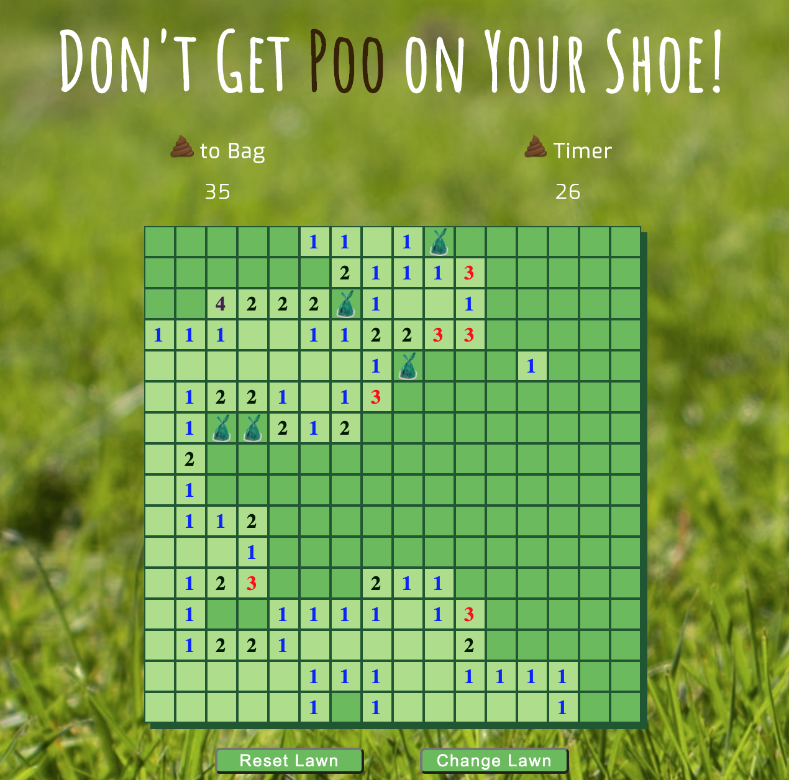
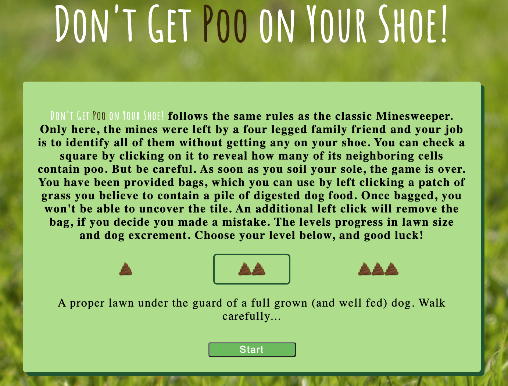

# SEI50 Project - ***Don't Get Poo on Your Shoe***

## Game Outline
Don't Get Poo on Your Shoe is designed to replicate Minesweeper, with a silly theme. The game takes place on a grid, in this case a 'lawn.' The objective is to clear the lawn by clicking grid cells, while avoiding clicking cell containing a mine ('poo'). The first click will always be safe and will reveal information related to the quantity of poos contained by the clicked item's neighboring cells. Using the numbers provided upon checking, a player can often deduce which cells are likely contain a poo. By left clicking, the player can 'bag' the poo. This will lock the cell so the player can't accidentally click on it. A second’s timer begins on the first click and ends upon losing or winning. Similar to classic Minesweeper, Don't Get Poo On Your Shoe offers 3 difficulty levels:

* *Easy:* 10 x 10 grid, with 10 poos placed randomly.

* *Medium:* 16 x 16 grid, with 40 poos placed randomly.

* *Hard:* 30 x 16 grid, with 99 poos placed randomly.

### Win
 A player wins after all cells have been cleared, with the exception of those containing poos. It is not required to bag any/all poos, the feature is there to simply make it easier to quickly click safe cells once poos are identified. An 'applause' sound effect is heard if the users volume is enabled.

### Lose
As soon as a cell containing a poo is clicked, the player has lost. The timer ends and is accompanied by a sound effect.

***
## Brief
* Render a grid-based game in the browser
* Design logic for winning & visual display of results
* Include separate HTML / CSS / JavaScript files
* Stick with KISS (Keep It Simple Stupid) and DRY (Don't Repeat Yourself) principles
* Use JavaScript for DOM manipulation
* Deploy your game online, where the rest of the world can access it
* Use semantic markup for HTML and CSS (adhere to best practices)

## Timeframe
The project took 7 days from planning to completion.

## Technologies Used
* JavaScript
* HTML5 with audio
* CSS3 with animation
* Git + Github

***
## Process
After outlining a basic HTML layout for the page and grid, I identified the basic requirements for the user to interact with and understand the game play. These included:

* Landing form and, later, a difficulty selection
* Creation of the grid
* Planting of the 'poos'
* Creation of the bag counter
* Creation of the timer
* Check clicked cell & neighbors for 'poos'
* Place bag
* Win/Lose check
* Game End & Reset

With the foundation planned and the basic HTML layout in mind, I created the function to set up the grid itself. Initially, the size was hardcoded. I would later add the ability for the user to select the size and quantity of mines before playing. I next needed to add the event listeners and necessary functions to make a playable game. 

A key step in the DOM manipulation was incorporating styling updates that would ensure the user understands what is happening as they interact with the game. I achieved this through a combination of specific functions and a recursive function to handle the bulk of the gameplay. Upon each click, the program will check the clicked cell and its neighbors for the presence of a game ending 'poo'. Neighbors include cells directly above, both sides, below as well as corners, meaning a cell can have a up to 8 neighbors. The clicked cell will change color and include a number to indicate how many neighboring cells contain a 'poo'. If a cell has no neighbors containing a 'poo,' the process recurses through each of its neighbors.

<p align='center'>

</p>

To ensure the first click is always safe, it was necessary to use that event to trigger the random placement of 'poos' within the grid before beginning the process of checking neighbors.

``` javascript
function firstClick () {
    const firstCellNum = Number(event.target.id)
    plantPoos(firstCellNum)
    assignPooClick()
    assignRegClick()
    cells.forEach(cell => {
      cell.removeEventListener('click', firstClick)
      cell.addEventListener('contextmenu', bagPoo)
    })
    pooCountDiv.classList.remove('pulse')
    checkPoos(firstCellNum)
    checkWin()
  }
```

With a functioning version of Minesweeper, I used the remaining time to add extra features to make it a more complete experience for the user. These included audio, animations and difficulty levels for the user to select.

<p align='center'>
  
</p>

## Wins & Challenges

Laying out the game was fairly straightforward; however, the rules and game play were deceivingly simple. On each click, the game had to evaluate neighbors recursively, removing event listeners, adjusting styles and updating a counter to indicate neighboring mines. Accounting for all these tasks, while ensuring the function wasn't 'wrapping' on edges or going beyond the bounds of the grid proved to be a fun challenge. That accounted for the bulk of the problem solving, with the much of the rest coming in the way of animations and styling.

## Key Takeaways

This was my first project using flex in CSS to layout the site. That really cut down on time spent styling and position the different elements of the game. In addition, I feel it was a good exercise in basic DOM manipulation.
